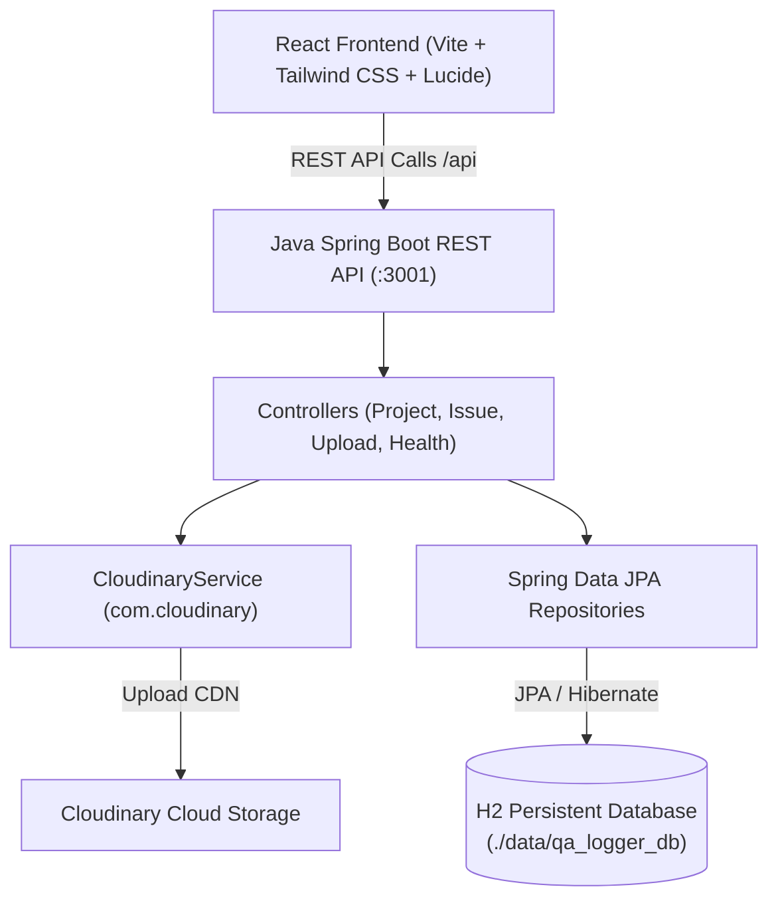

# ?? QA Issue Logger — Software Defect & Test Management Platform

A modern, responsive defect tracking web application built for QA Engineers and Software Testers. Supports multi-project defect logging with all required QA fields, automated sequential numbering, real-time status tracking, screenshot capture, and a robust Java Spring Boot REST backend with H2 database persistence.

---

## ?? Key Features

- **Multi-Project Management**: Manage defects across independent software projects with customizable prefix identifiers (e.g. `SHOP-1`, `BANK-1`).
- **All 8 Standard QA Defect Fields**:
  1. `Sr. No.` (Auto-incremental sequential numbering per project)
  2. `Date`
  3. `Module / Feature Area`
  4. `Issue / Error Description`
  5. `Expected Result`
  6. `Screenshot` (Local upload or Cloudinary CDN integration)
  7. `Status` (`Open`, `In Progress`, `Resolved`, `Closed`, `Blocked`, `Reopened`)
  8. `Remarks` (Browser, OS, Environment details, reproduction steps)
- **Responsive Dual View**:
  - **Data Table View (?)**: Sticky headers, inline quick add, and responsive scroll container.
  - **Card Grid View (?)**: Adaptive 1/2/3-column responsive card layout.
- **Interactive UI**:
  - Dark Mode & Light Mode (persisted in `localStorage`).
  - Keyboard Shortcuts (<kbd>/</kbd>, <kbd>Ctrl+N</kbd>, <kbd>Ctrl+V</kbd>, <kbd>T</kbd>, <kbd>D</kbd>, <kbd>?</kbd>).
  - Floating Multi-Select Bulk Actions Bar (Mark Resolved, Mark In Progress, Delete Selected).
  - One-Click bug report summary copy to clipboard.
  - CSV (Excel) & JSON Backup exports.
- **Java Spring Boot Backend**:
  - Spring Boot 3.4.x + Spring Data JPA + Hibernate.
  - Persistent H2 Database (`jdbc:h2:file:./data/qa_logger_db`).
  - H2 Web Console available at `/h2-console`.
  - Cloudinary Java SDK integration configured in `application.properties`.
  - Dual-mode client sync with browser IndexedDB fallback.

---

## ??? Architecture & Tech Stack



| Layer | Technologies |
|---|---|
| **Frontend** | React 19, TypeScript, Tailwind CSS, Lucide Icons, Dexie (IndexedDB) |
| **Backend** | Java 21/24, Spring Boot 3.4.3, Spring Web, Spring Data JPA, Hibernate |
| **Database** | H2 Database (File-based persistent storage) |
| **Media / CDN** | Cloudinary Java SDK (`cloudinary-http44`) + Local disk upload fallback |

---

## ?? Configuration (`application.properties`)

Located at `backend/src/main/resources/application.properties`:

```properties
server.port=3001

# Cloudinary Configuration
cloudinary.cloud-name=your_cloud_name
cloudinary.api-key=your_api_key
cloudinary.api-secret=your_api_secret
cloudinary.url=

# Database Configuration (H2 File-based Persistent DB)
spring.datasource.url=jdbc:h2:file:./data/qa_logger_db;DB_CLOSE_ON_EXIT=FALSE;AUTO_RECONNECT=TRUE
spring.datasource.driverClassName=org.h2.Driver
spring.datasource.username=sa
spring.datasource.password=
spring.jpa.database-platform=org.hibernate.dialect.H2Dialect
spring.jpa.hibernate.ddl-auto=update

# H2 Web Console
spring.h2.console.enabled=true
spring.h2.console.path=/h2-console
```

---

## ?? REST API Endpoints

| Method | Endpoint | Description |
|---|---|---|
| `GET` | `/api/health` | Service health & database connectivity check |
| `GET` | `/api/projects` | List all projects |
| `POST` | `/api/projects` | Create a new project |
| `PUT` | `/api/projects/{id}` | Update project |
| `DELETE`| `/api/projects/{id}` | Delete project and cascade-delete issues |
| `GET` | `/api/issues?projectId={id}` | Fetch all issues for a project |
| `GET` | `/api/issues/next-sr?projectId={id}` | Get next sequential `srNo` |
| `POST` | `/api/issues` | Create new defect report |
| `PUT` | `/api/issues/{id}` | Update defect details |
| `DELETE`| `/api/issues/{id}` | Delete defect |
| `POST` | `/api/issues/bulk-status` | Bulk update status for multiple defects |
| `POST` | `/api/issues/bulk-delete` | Bulk delete multiple defects |
| `POST` | `/api/upload` | Upload screenshot to Cloudinary / storage |

---

## ?? Getting Started

### 1. Prerequisites
- Node.js v18+ & npm
- Java JDK 21 or 24

### 2. Run the Java Backend
```bash
cd backend
./mvnw spring-boot:run
```
Backend will start on `http://localhost:3001`.
H2 Web Console available at `http://localhost:3001/h2-console`.

### 3. Run the Frontend
```bash
npm install
npm run dev
```
Open `http://localhost:5173` in your browser.

---

## ????? Author
- **Khushi Singhal** ([@Khushi-Singhal7](https://github.com/Khushi-Singhal7))

---

## ?? 1-Click Free Cloud Deployment (Render.com)

You can deploy this full-stack application (React UI + Java Spring Boot + H2 Database) for **free on Render.com**:

1. Go to **[dashboard.render.com](https://dashboard.render.com)** and sign in with GitHub.
2. Click **New +** ? **Web Service**.
3. Select your repository: **`Khushi-Singhal7/qa-issue-logger`**.
4. Render will automatically detect the **Dockerfile**!
5. Select the **Free** instance type.
6. Click **Deploy Web Service**!
7. Render will build and launch your live application at `https://qa-issue-logger.onrender.com`.
